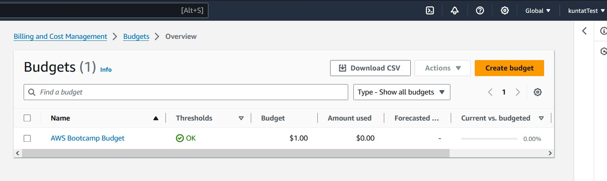
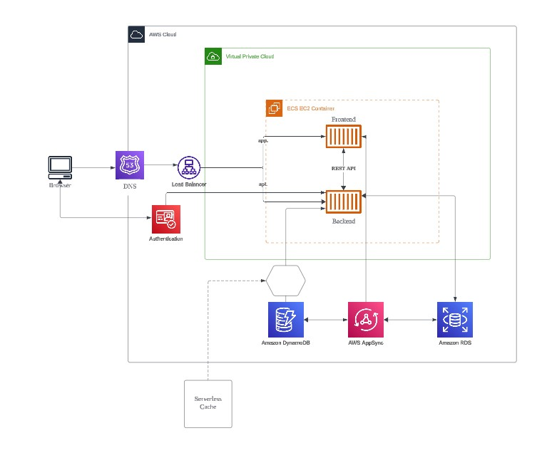

# Week 0 — Billing and Architecture

## Required Homework

### Create a Billing Alarm

### Create a Budget
I created a Budget alarm from only $1 spend and did not create a second alarm to keep within the free limit of 2 alarms.

### Recreate Logical Architectural Design

[Lucid Charts Share Link](https://lucid.app/lucidchart/68bc5505-2ec4-4fa1-bd05-24690f0145c6/edit?viewport_loc=-1749%2C-584%2C1545%2C1746%2C0_0&invitationId=inv_187de1eb-1bac-4290-8598-287b8e692946)

## Homework Challenges
